# 🧪 Home Lab Project: Active Directory & Splunk Detection Engineering

---

## Objective

Design, deploy, attack, and defend a realistic enterprise-style Active Directory environment instrumented with Splunk and Sysmon. This lab prioritizes **evidence**, **detection engineering maturity**, and **MITRE ATT&CK alignment** over basic tool installation.

---

## 🎯 1. Project Overview & Goals

### 1.1 Purpose

This project simulates a small, isolated enterprise network consisting of:

- An Active Directory domain
- A domain-joined Windows workstation
- A centralized SIEM (Splunk)
- An attacker system (Kali Linux)

The core objective is to operationalize **Blue Team workflows**—log quality validation, detection engineering, and incident analysis—by executing controlled **Red Team adversary emulation** and validating that high-fidelity telemetry is generated, transported, ingested, and detected end-to-end.

### 1.2 Learning Objectives

| Category                                  | Objectives                                                                                                                                                                                                         |
| ----------------------------------------- | ------------------------------------------------------------------------------------------------------------------------------------------------------------------------------------------------------------------ |
| **Blue Team**                             | Log ingestion quality control (completeness, fidelity, timing); Detection and alert engineering using Splunk SPL; Threat-informed defense using MITRE ATT&CK; Timeline correlation and raw-event forensic analysis |
| **Red Team**                              | Adversary emulation using Atomic Red Team; Persistence, lateral movement, and privilege escalation simulation                                                                                                      |
| **Infrastructure & Security Engineering** | Active Directory deployment and security hardening; Centralized audit policy enforcement via Group Policy; Endpoint telemetry design (Sysmon + Windows logging); Network isolation and lab safety controls         |

---

## 🏗️ 2. Lab Architecture & Topology

### 2.1 Network Segmentation

| Network     | CIDR             | Purpose                        | Notes                                                                                             |
| ----------- | ---------------- | ------------------------------ | ------------------------------------------------------------------------------------------------- |
| Lab Network | 192.168.100.0/24 | Isolated enterprise simulation | NAT/Host-Only only. No bridged access. All systems reside on a strictly isolated virtual network. |

### 2.2 Component Inventory

| Component         | OS                | IP                      | Role                 |
| ----------------- | ----------------- | ----------------------- | -------------------- |
| Domain Controller | Windows Server    | 192.168.100.6 (Static)  | AD DS, DNS, DHCP     |
| SIEM Server       | Ubuntu Linux      | 192.168.100.10 (Static) | Splunk Enterprise    |
| Client Endpoint   | Windows 10        | DHCP                    | Domain-joined victim |
| Attacker          | Kali Linux 2023.4 | 192.168.100.17 (Static) | Adversary emulation  |

### 2.3 Evidence: Environment Existence, Architecture & Connectivity

**Purpose Statement**
This section provides proof that the lab environment exists, is isolated, and is operational. Evidence validates concurrent VM execution, deliberate network isolation, control-plane functionality, and Layer 3 connectivity.

**Network Diagram**

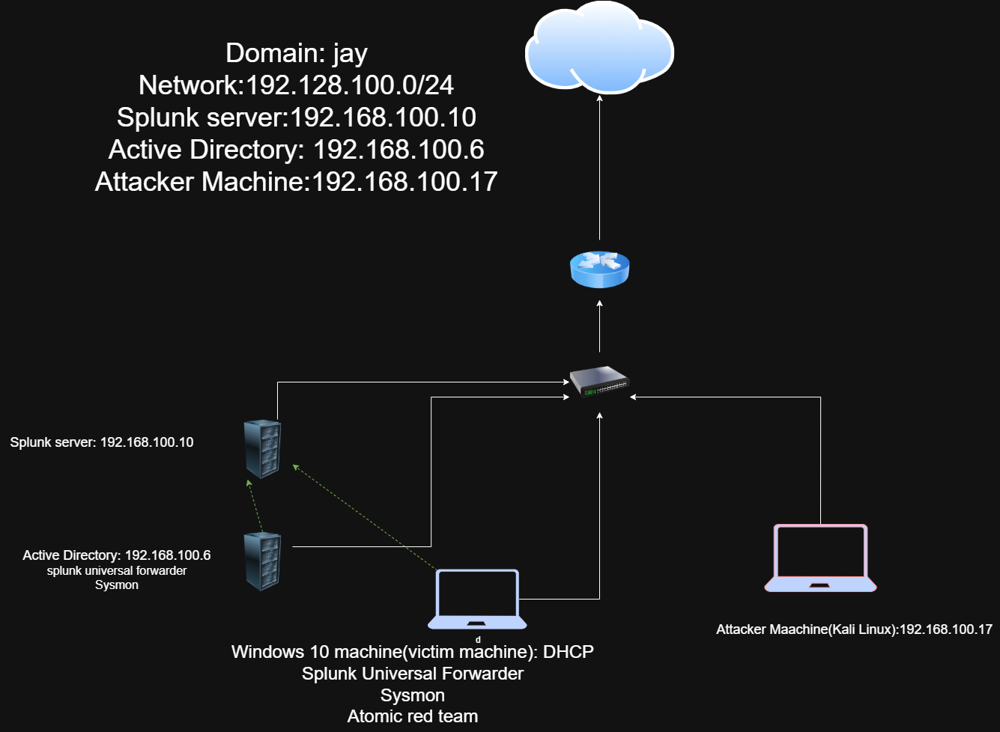

**Hypervisor Overview (VirtualBox)**

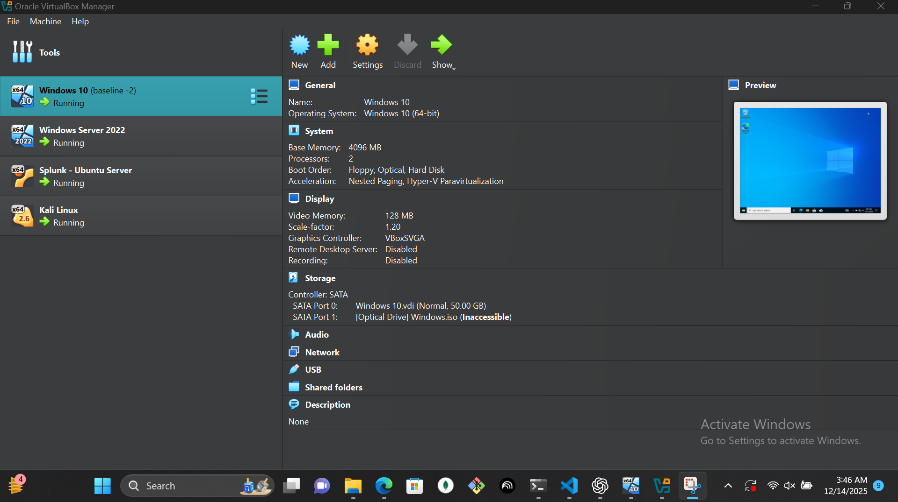

**VM Network Adapter Settings**

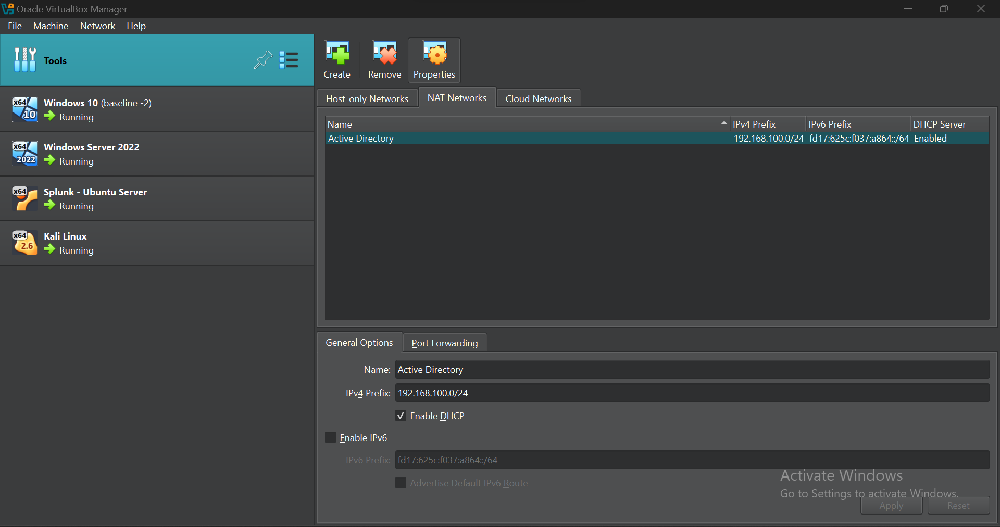

**System Uptime Proof (Domain Controller)**

The following screenshot shows sustained uptime on the Domain Controller, demonstrating system stability and continuous operation during lab activity.

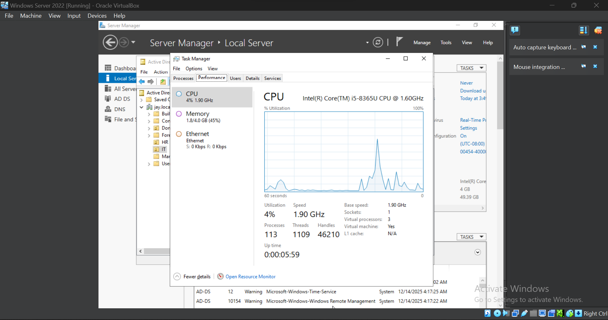

**DNS Resolution Proof**

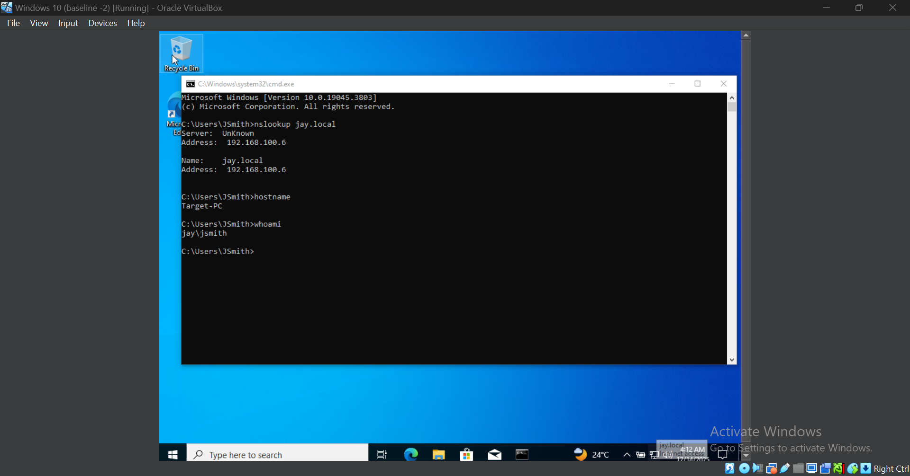

**IP Configuration (DC)**

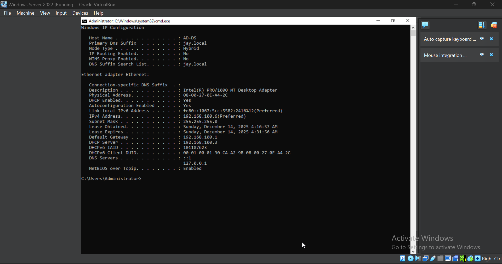

**Ping Test**

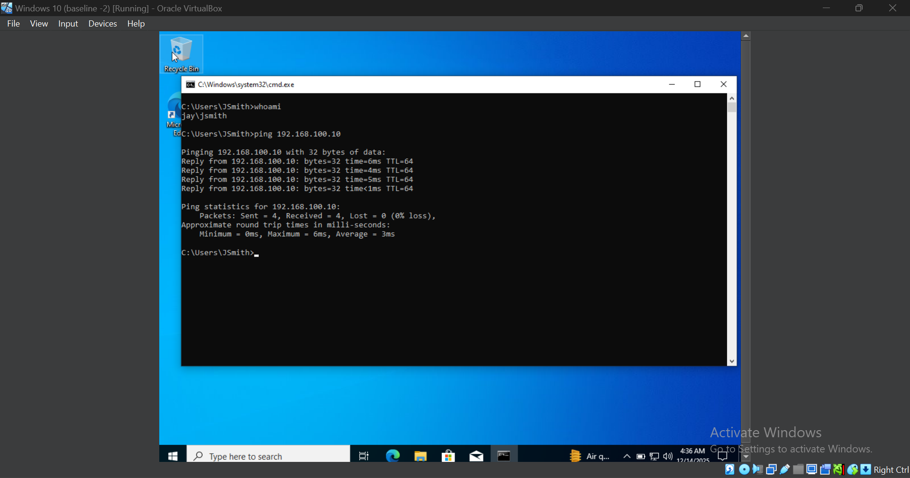

---

## 🛠️ 3. Technologies & Tools

## 3.1 SIEM & Telemetry

The core of the detection capabilities relies on robust logging and a powerful centralized platform. **Splunk Enterprise** was selected due to its industry-standard search language (SPL), mature ecosystem, and suitability for small-to-medium lab environments.

### SIEM Platform: Splunk Enterprise (Free License)

**Purpose:**
Centralized log ingestion, storage, correlation, and alerting. The free license provides sufficient daily indexing capacity for a lab of this scope while preserving full SPL functionality required for detection engineering.

### Forwarders: Splunk Universal Forwarder (UF)

**Purpose:**
Lightweight agents deployed on the **Domain Controller** and **Client Endpoint**, responsible for securely and reliably forwarding local telemetry to the Splunk indexer with minimal performance overhead.

### Telemetry Sources

- **Windows Security, System, and Application Logs**
  Standard Windows logging baseline providing essential context for:

  - User authentication and authorization events (e.g., Event IDs 4624, 4625)
  - System and service state changes
  - Application errors and failures

- **Sysmon (Operational Log)**
  Provides high-fidelity endpoint telemetry, enabling deep visibility into host activity, including:

  - Process creation (Event ID 1)
  - Network connections (Event ID 3)
  - File creation and deletion events

  This telemetry is critical for detecting malware execution, lateral movement, and living-off-the-land techniques.

- **PowerShell Script Block Logging (Event ID 4104)**
  Captures the full content of PowerShell commands, including those that are obfuscated or executed in-memory. This logging is essential for detecting advanced attack frameworks and fileless tradecraft.

---

## 3.2 Adversary Emulation

Controlled adversary testing is used to validate detection logic against known, standardized threat behaviors rather than ad-hoc attack simulation.

### Tool: Atomic Red Team

**Purpose:**
A curated library of small, focused tests aligned directly to the **MITRE ATT&CK** framework. This ensures that adversary emulation is threat-informed, repeatable, and mapped to real-world attacker techniques.

### Execution Method: Invoke-AtomicRedTeam PowerShell Module

**Purpose:**
Used to execute specific TTPs (Tactics, Techniques, and Procedures) against target systems in a controlled manner. This approach enables consistent attack execution, reliable telemetry generation, and repeatable validation of detection logic and alerting workflows.

---

## ⚙️ 4. Deployment & Configuration

---

### 4.1 Active Directory & Group Policy

The Domain Controller was deployed using the Windows Server graphical management tools to establish centralized identity, authentication, and policy enforcement for the lab environment.

#### Active Directory Domain Services Deployment (GUI-Based)

Active Directory Domain Services (AD DS) was installed via **Server Manager**, followed by domain promotion using the **AD DS Configuration Wizard**.

Deployment steps included:

- Installing the **Active Directory Domain Services (AD DS)** role through Server Manager
- Promoting the server to a Domain Controller
- Creating a new forest with the domain name:

  ```
  jay.local
  ```

- Configuring integrated DNS during domain promotion
- Completing post-installation reboot and validation

This process established `jay.local` as the authoritative domain for all Windows-based systems within the lab.

#### Group Policy Configuration

A custom Group Policy Object (GPO) was created and linked at the domain level to enforce **Advanced Audit Policy Configuration**, ensuring the generation of high-fidelity security telemetry.

Configured audit settings include:

- **Process Creation** auditing (Success and Failure)
- **Command Line Process Auditing**

These policies ensure consistent, centrally enforced logging across all domain-joined systems and provide the foundational telemetry required for reliable detection engineering.

---

### 4.2 Telemetry Configuration

Endpoint and server telemetry was deliberately configured to maximize detection fidelity while minimizing unnecessary noise.

- **Sysmon Deployment**
  The Sysmon service was installed on the Windows 10 client using a pre-downloaded configuration file. This configuration enables detailed visibility into process execution, network activity, and file system changes.

- **Splunk Universal Forwarder Setup**
  The Splunk Universal Forwarder (UF) was installed and configured on both the **Domain Controller** and the **Windows 10 client (WIN10-CL)**.

  The forwarders were configured to monitor:

  - Windows Security, System, and Application Event Logs
  - The Sysmon Operational Event Log

  Telemetry is securely forwarded to the centralized Splunk indexer for correlation and analysis.

---

### 4.3 Evidence: Control Plane, Audit & Telemetry Validation

**Purpose Statement**
The evidence in this section confirms that directory services, audit policies, and endpoint telemetry are intentionally configured, centrally enforced, and actively generating security-relevant events required for reliable detection engineering.

---

#### AD DS Confirmation (Active Directory Maturity)

## 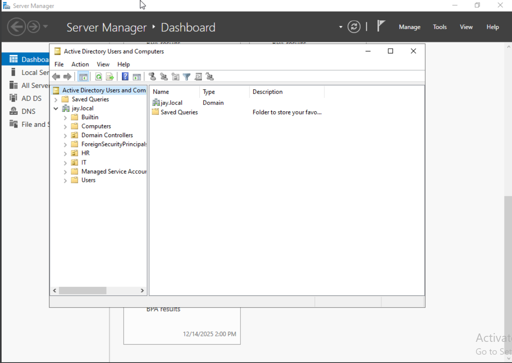

#### GPO Link Confirmation

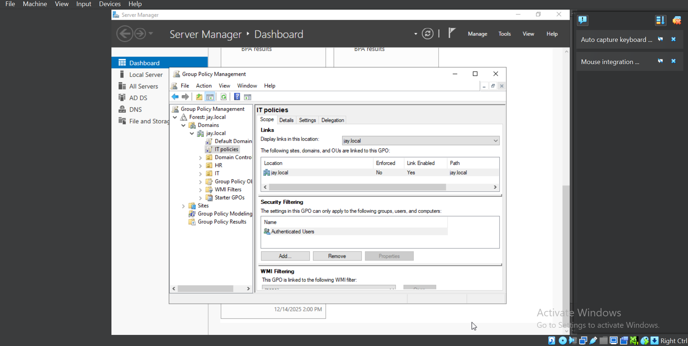

---

#### Sysmon Configuration Loaded (Forensic Credibility)

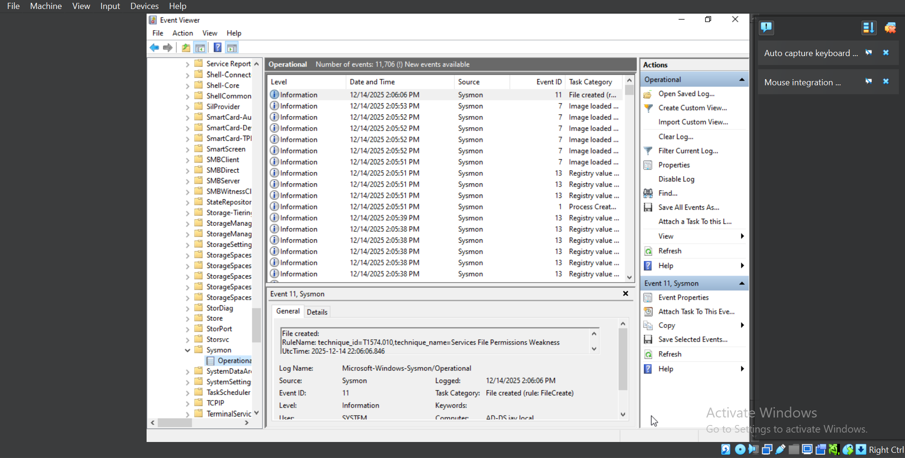

---

#### Splunk Server Configuration

```
[Screenshot Placeholder]
Splunk Web UI displaying:
- Data input configuration (e.g., TCP input on port 9997)
- Input enabled and listening for forwarder data
```

---

#### Splunk Forwarder Status (Ingestion Proof)

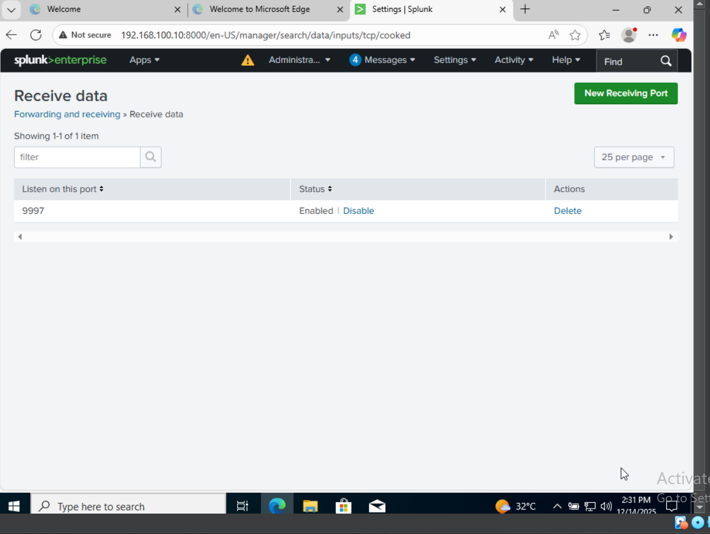

---

#### Splunk Data Ingestion

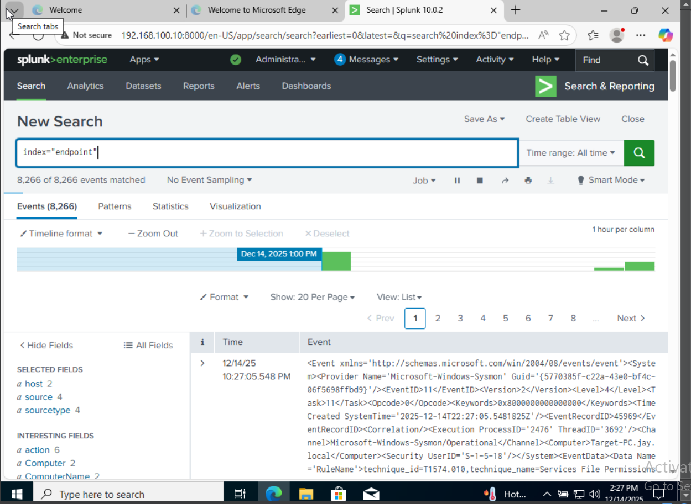

---

````md
## 5. Adversary Simulation and Detection Evidence

### 5.1 Scenario 1 — Persistence: Local Account Creation (T1136.001)

#### Attack Steps

- **Technique:** T1136.001 – Create Account: Domain Account
- **Tool:** Atomic Red Team (T1136.001 Test #1) using PowerShell

**Command Run:**

```powershell
Invoke-AtomicTest T1136.001
```
````

#### Attack Execution Evidence

**Purpose Statement:**
The Screenshots in this subsection document the deliberate execution of a domain persistence technique from a non-authoritative host, establishing the initial adversary action.

**Command Line Execution:**

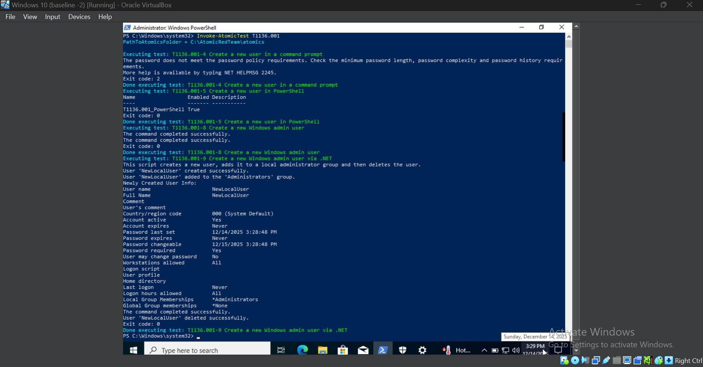

#### Detection & Analysis Evidence

**Purpose Statement:**
The screenshots in this subsection establish temporal causality between the attack and the resulting telemetry, demonstrating that detection logic accurately identified anomalous account creation behavior.

- **Log Source:** Windows Security Event Log
- **Event ID:** 4720 — _A user account was created_

**Query Used in SIEM (Splunk SPL):**

```spl
index=endpoint EventCode=4720  Account_Name=NewLocalUser
| table _time, Account_Name, Caller_Computer_Name
```

**Findings:**
The query successfully identified Event ID 4720 originating from the client machine (Windows 10) rather than the Domain Controller. This behavior is a strong indicator of compromise.

**Mitigation:**
A correlation rule was created to alert whenever a new domain user (EventCode 4720) is created by a non-Domain Controller host, mapping directly to **T1136.002 (Domain Account Creation)**.

**Timeline Correlation:**

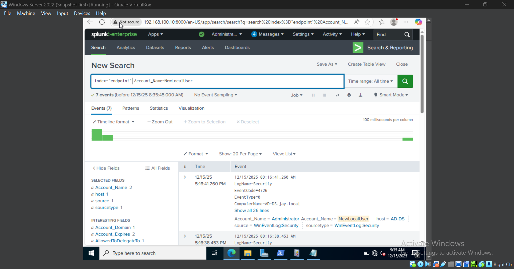

**Raw Event View:**

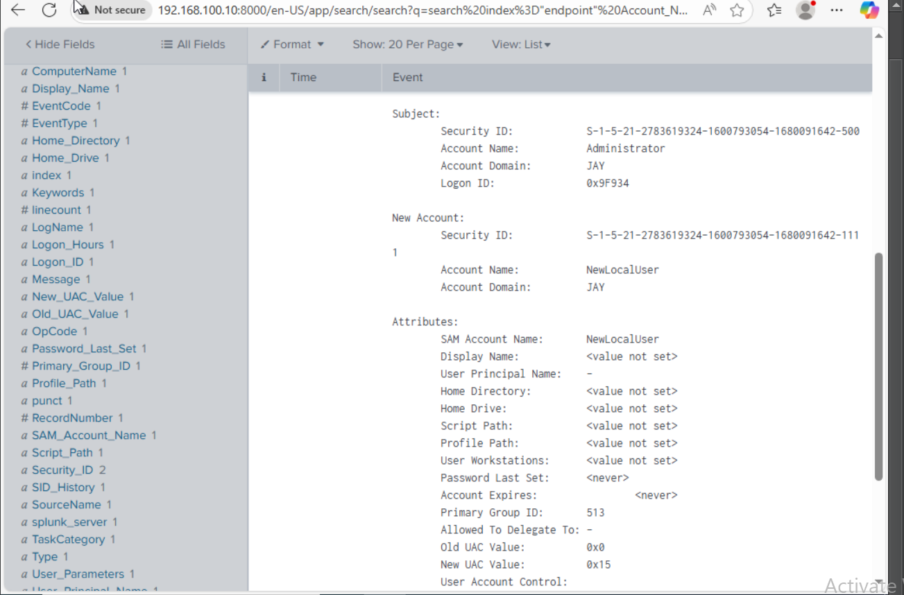

---

Here’s the **clean, correct rewrite mapped to T1059 (Command and Scripting Interpreter)**. This aligns better with PowerShell execution and avoids the PsExec/lateral-movement mismatch. No fluff.

````md
### 5.2 Scenario 2 — Command Execution: PowerShell (T1059.001)

#### Attack Steps

- **Technique:** T1059.001 – Command and Scripting Interpreter: PowerShell
- **Description:** Execution of attacker-controlled PowerShell commands on the compromised Windows 10 client to simulate post-compromise activity.
- **Tool:** Atomic Red Team (T1059.001) using PowerShell

**Command Run (Simplified):**

```powershell
Invoke-AtomicTest T1059.001 -TestNum 1
```
````

#### Attack Execution Evidence

**Purpose Statement:**
The screenshots in this subsection demonstrate successful execution of PowerShell-based command execution consistent with adversary post-exploitation behavior.

**PowerShell Test Output:**

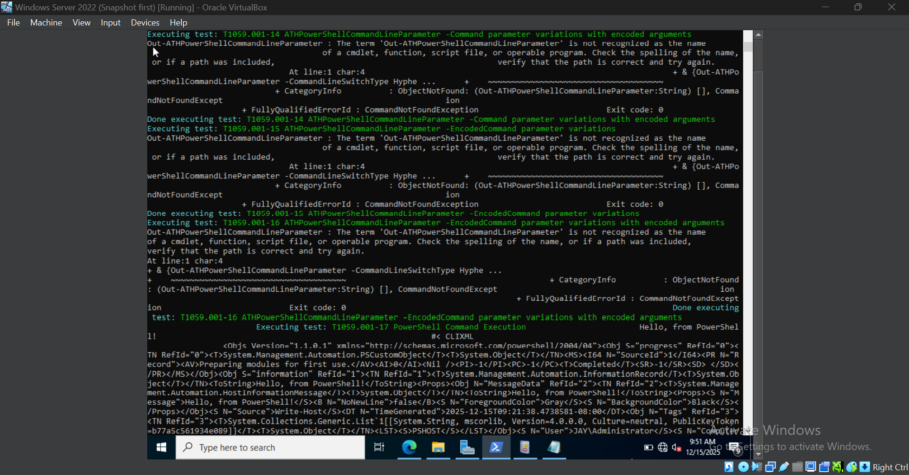

---

#### Detection & Analysis Evidence

**Purpose Statement:**
The screenshots in this subsection demonstrate that Sysmon telemetry captured suspicious PowerShell execution and that detection logic correctly identified command-line interpreter abuse.

- **Log Source:** Sysmon
- **Event ID:** 1 — _Process Creation_
- **Focus:** `powershell.exe` execution with suspicious command-line arguments

**Query Used in SIEM (Splunk SPL):**

```spl
index=sysmon EventCode=1 Image="*\\powershell.exe"
| stats count by Computer, CommandLine, ParentCommandLine, User
| rename ParentCommandLine as OriginatingProcess
```

**Findings:**
The query reveals anomalous PowerShell execution originating from the Windows 10 client. The observed command-line activity is consistent with adversary-controlled command execution, mapped to **T1059.001**.

**Mitigation:**
Alert on Sysmon Event ID 1 where `powershell.exe` is executed with encoded commands, suspicious flags (e.g., `-EncodedCommand`, `-nop`, `-w hidden`), or from non-standard parent processes.

**Query Result (Process Tree View):**

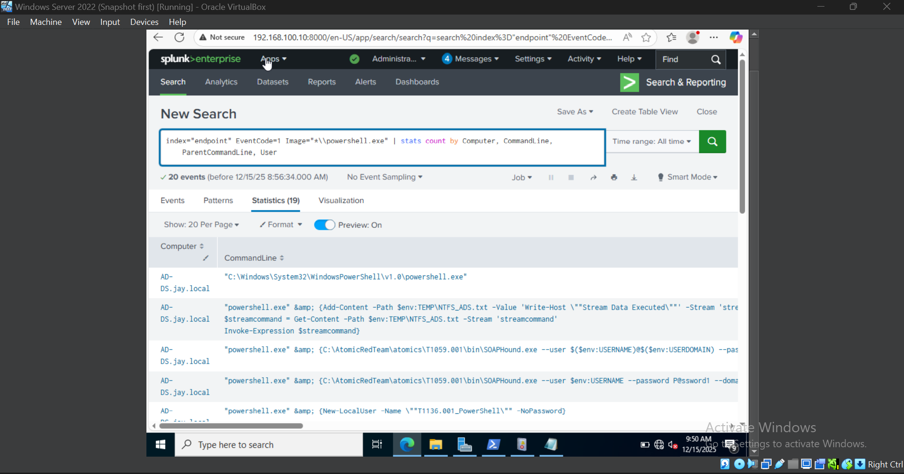

---
